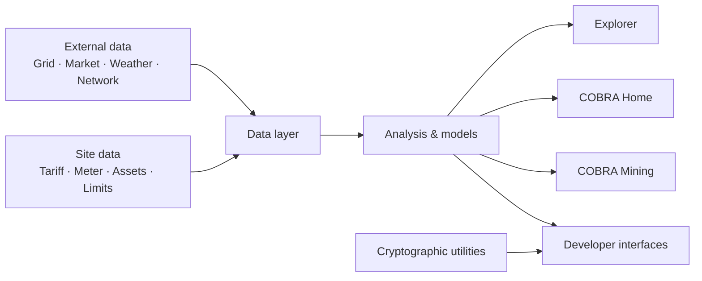

# COBRA

<p align="center">
  
</p>

**Electricity, site and compute analysis.**

> **Project status:** Active development · **Version:** `0.3.0-alpha`

COBRA integrates electricity-system, market, site and compute data for monitoring, economic analysis and site-level decision support.

The public repository contains inspectable software, reference implementations, cryptographic utilities, public interfaces and developer tooling. Hosted customer infrastructure, customer data and protected analytical components are maintained separately.

> **Project lineage:** COBRA began as a university cryptography project focused on Bitcoin address generation and subsequently expanded into compute and energy intelligence. Some retained pages, repository paths and historical materials reflect the earlier scope while documentation and links are progressively aligned with the current platform. Historical components are preserved for provenance; current technical direction is documented in this README and the [Technical Overview](docs/TECHNICAL.md).

[Website](https://cobra-protocol.org) · [Explorer](https://cobra-protocol.org/explorer.html) · [Research](https://cobra-protocol.org/research.html) · [Technical](docs/TECHNICAL.md) · [Provenance](docs/PROVENANCE.md) · [Security](SECURITY.md) · [Contributing](CONTRIBUTING.md)

[](LICENSE)
[](https://github.com/ol-s-cloud/bitcoin-address-generator/actions)

---

## System overview



COBRA separates external observations, site-specific data and calculated outputs. Provider data is normalised before use by higher-level calculations. Missing or unavailable inputs are represented through explicit availability states.

Detailed architecture is maintained in the [Technical Overview](docs/TECHNICAL.md).

---

## Components

| Component | Function |
| --- | --- |
| **Explorer** | Public electricity, Bitcoin/network and compute-related indicators |
| **COBRA Home** | Household and property-level energy analysis |
| **COBRA Mining** | ASIC/site configuration, facility modelling and mining economics |
| **Cryptographic utilities** | Bitcoin-oriented address and cryptographic tooling |
| **Offline tools** | Local cryptographic workflows |
| **CLI** | Developer and cryptographic command-line interface |
| **Public APIs** | Programmatic access to released functions and data interfaces |
| **Research interfaces** | Reproducible public technical and analytical work |

---

## Data sources

COBRA uses provider-specific adapters around a common internal data model.

| Source | Data |
| --- | --- |
| **NESO** | Great Britain electricity-system conditions |
| **Elexon** | Balancing and electricity-market data |
| **Octopus Energy** | Consented customer tariff and consumption data |
| **EPC** | Building energy-performance information |
| **PVGIS** | Solar-resource and photovoltaic estimates |
| **Bitcoin network sources** | Network and blockchain observations |
| **Mining-market sources** | SHA-256 hashprice and related mining metrics |
| **Manufacturer specifications** | Equipment characteristics |
| **Site inputs** | Tariffs, capacity, assets and operating assumptions |
| **FX sources** | Currency-normalised calculations |

Source metadata, timestamps, units and availability states are preserved through the analysis pipeline.

---

## Mining reference model

COBRA Mining combines site and market inputs including:

```text
ASIC specification
+ quantity
+ site power limit
+ electricity rate
+ facility PUE
+ pool fee
+ operating cost
+ hashprice
+ FX
```

Calculated outputs include active hashrate, facility power, electricity consumption, gross revenue, electricity cost, operating profit, operating margin, break-even electricity rate and site capacity.

Site profitability calculations combine market information with site-specific operating assumptions.

---

## Technical stack

The public repository contains components implemented across:

- Python package and command-line tooling;
- browser-based JavaScript, HTML and CSS;
- Node.js server-side and API components;
- PostgreSQL-backed hosted functionality;
- external data-provider adapters;
- automated Node.js and Python testing;
- GitHub Actions continuous integration.

Database-backed components use server-side environment configuration. Environment variables are documented in [`.env.example`](.env.example).

---

## Engineering standards and frameworks

COBRA uses established standards and frameworks as engineering references across information security, energy management, software assurance and AI-enabled components.

| Reference | Scope |
| --- | --- |
| **ISO/IEC 27001:2022** | Information-security management |
| **ISO 50001:2018** | Energy-management systems and energy-performance improvement |
| **ISO/IEC 42001:2023** | AI management for applicable AI/ML components |
| **NIST Cybersecurity Framework 2.0** | Cybersecurity risk management |
| **OWASP ASVS 5.0** | Web and application security verification |
| **IEC 62443 series** | Industrial and operational-technology cybersecurity |

These references guide engineering and governance work. Formal certification and conformity status are reported separately following assessment.

---

## Repository boundary

This repository is the public upstream and provenance record for COBRA.

The public repository includes public interfaces, cryptographic utilities, documented schemas, public-data integrations, reference calculations, CLI tooling and reproducible technical examples.

Production credentials, customer datasets, customer infrastructure and protected analytical implementations are maintained within their respective private environments.

See [Technical Overview](docs/TECHNICAL.md), [Security](SECURITY.md) and [Project Provenance](docs/PROVENANCE.md).

---

## Repository provenance

COBRA originated from the `ol-s-cloud/bitcoin-address-generator` repository. The original cryptographic implementation, notebook and Git history remain part of the project's public development provenance.

- [Project provenance](docs/PROVENANCE.md)
- [Archived original README](archive/README-bitcoin-address-generator-2025.md)
- [Original Bitcoin-address notebook](How_To_Create_A_Bitcoin_Address_From_Randomly_Generated_Numbers.ipynb)

---

## Local development

```bash
git clone https://github.com/ol-s-cloud/bitcoin-address-generator.git
cd bitcoin-address-generator
npm install
npm test
```

For Python development:

```bash
pip install -e .
```

CLI usage is documented in the [CLI Guide](docs/CLI.md). Public API functions are documented in the [API Reference](docs/API.md). Offline cryptographic workflows are documented in the [Offline Guide](COBRA_OFFLINE_GUIDE.md).

---

## Documentation

| Reference | Scope |
| --- | --- |
| [Technical Overview](docs/TECHNICAL.md) | Architecture, data model and engineering concepts |
| [API Reference](docs/API.md) | Public package interfaces |
| [CLI Guide](docs/CLI.md) | Command-line tooling |
| [Offline Guide](COBRA_OFFLINE_GUIDE.md) | Local cryptographic workflow |
| [Web Application](WEB_APP.md) | Public web implementation |
| [Project Provenance](docs/PROVENANCE.md) | Repository lineage and retained history |
| [Security](SECURITY.md) | Security policy and disclosure |
| [Contributing](CONTRIBUTING.md) | Contribution process |
| [Code of Conduct](CODE_OF_CONDUCT.md) | Community participation |

---

## References

Primary external references include:

- [National Energy System Operator](https://www.neso.energy/)
- [Elexon](https://www.elexon.co.uk/)
- [Octopus Energy Developer API](https://developer.octopus.energy/)
- [European Commission JRC PVGIS](https://re.jrc.ec.europa.eu/pvg_tools/en/)
- [Bitcoin Core](https://bitcoincore.org/)
- [ISO/IEC 27001:2022](https://www.iso.org/standard/27001)
- [ISO 50001:2018](https://www.iso.org/standard/69426.html)
- [ISO/IEC 42001:2023](https://www.iso.org/standard/42001)
- [NIST Cybersecurity Framework 2.0](https://www.nist.gov/cyberframework)
- [OWASP ASVS](https://owasp.org/projects/asvs)
- [IEC 62443](https://syc-se.iec.ch/deliveries/cybersecurity-guidelines/security-standards-and-best-practices/iec-62443/)

---

## License

This repository is distributed under the [MIT License](LICENSE).

External datasets, APIs and services retain their respective licences, terms and attribution requirements.

---

**COBRA · ol-s-cloud**